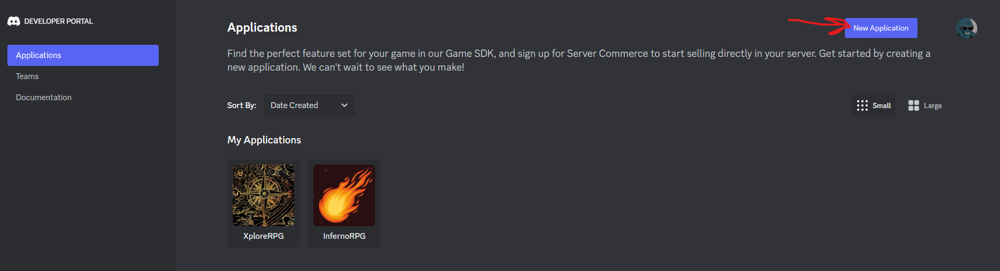
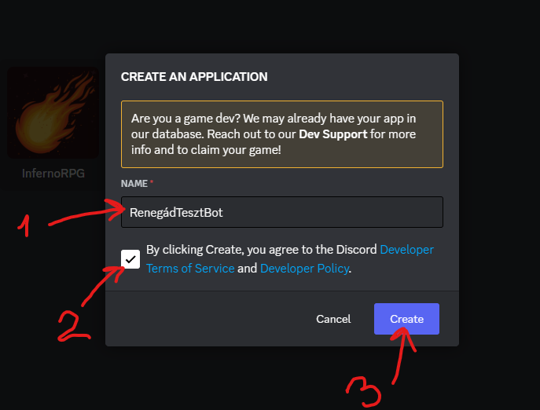
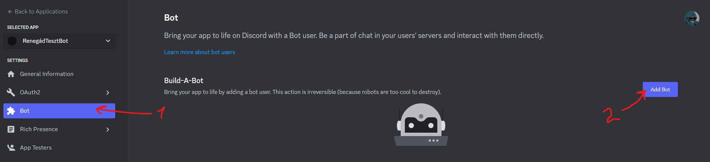
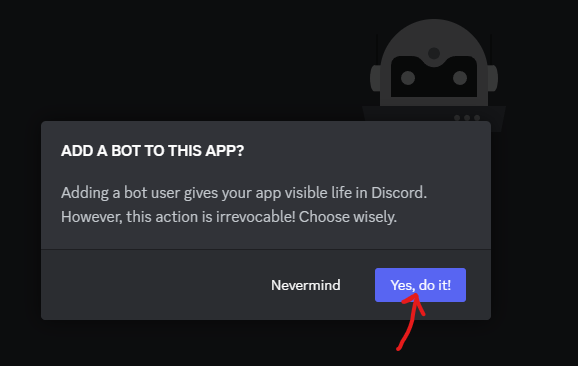
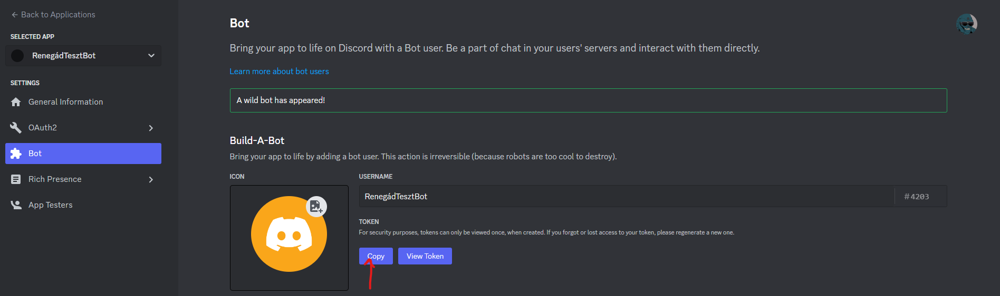
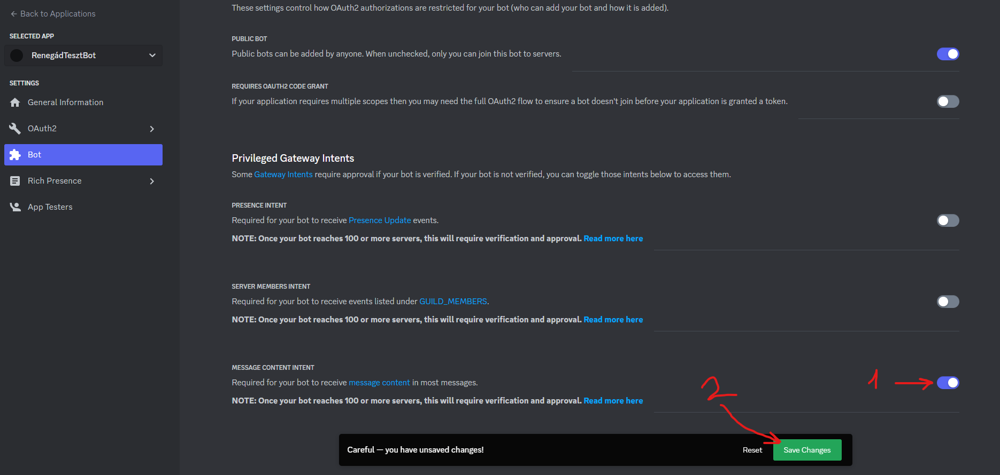
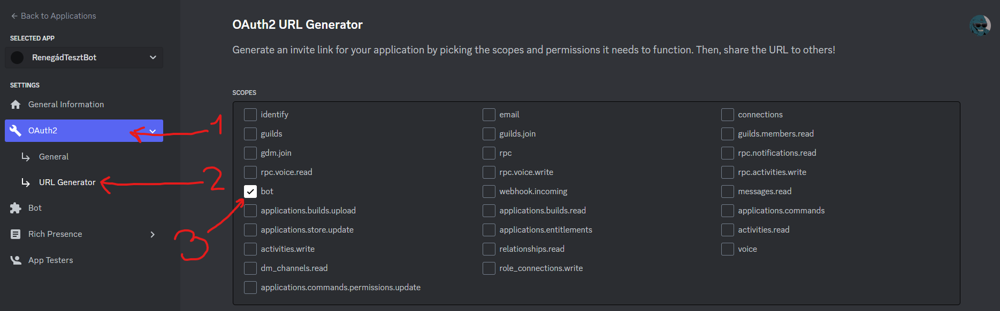
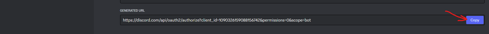
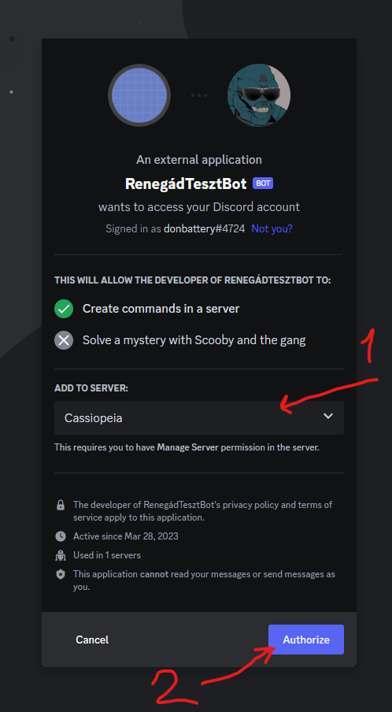

## Hogyan csinálhatok magamnak Discord bot-ot
Ahhoz, hogy magunknak futtassuk a játékot, előszöris kell egy saját Discord account, és meg kell csinálni a Discord-os bot-ot is a [Discord Developer Portálon](https://discord.com/developers/applications)  

Lépések
- Jobb fölső sarok: New Application (adj neki egy nevet és Create)  

- Bal oldali menü: Bot (Add bot. Yes, do it!)  

- Copy Token (ezt mentsük le mert ez fog kelleni a csatlakozáshoz később)  

- Szkrollozz lejjebb, kattintsd be a Message Content Intent-et és mentsd el a változásokat  

- Bal oldali menü: OAuth2, URL Generator, válaszd ki a bot-ot  

- Szkrollozz le és copyzd be a linke-et  

- Ezzel a linkel tudod meghívni a botot a szervereidre.  

